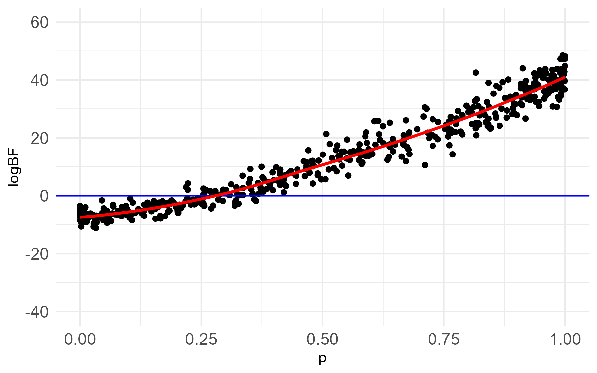
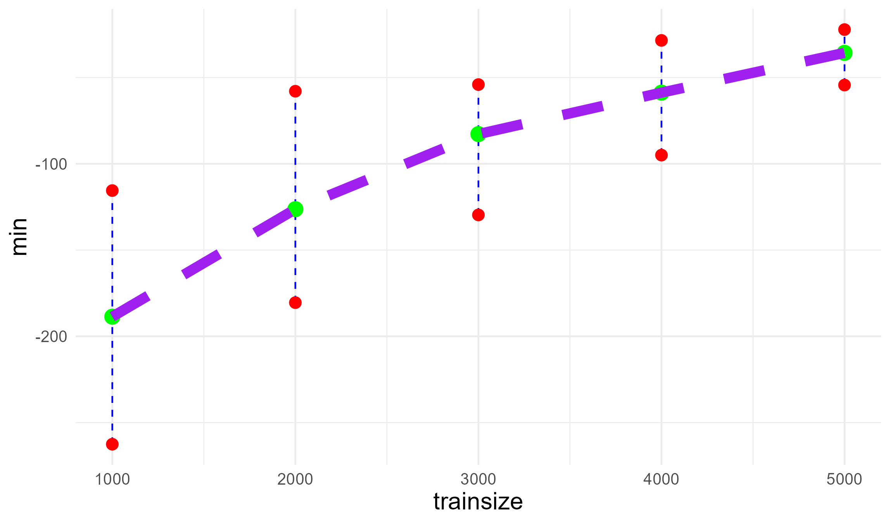

# CVBF Two-Sample Testing

This repository provides code for simulation study and real data analysis presented in the following paper:

&nbsp;&nbsp; Merchant, N., Hart, J.D., Kim, M., and Choi, T. (2024) "Use of Cross-validation Bayes Factors to Test Equality of Two Densities." Statistics (*Revised version submitted.*)

### Authors

Naveed Merchant, Texas A&M University (nmerchant@stat.tamu.edu)<br/>
Jeffrey D. Hart, Texas A&M University (hart@stat.tamu.edu)<br/>
Minhyeok Kim, Korea University (kmh15937@korea.ac.kr)<br/>
Taeryon Choi, Korea University (trchoi@korea.ac.kr)<br/>

### Maintainers

Naveed Merchant, Texas A&M University (R package [BSCRN](https://github.com/naveedmerchant/BayesScreening)) (nmerchant@stat.tamu.edu)<br/>
Minhyeok Kim, Korea University (Github page) (kmh15937@korea.ac.kr)<br/>

## Introduction

We propose a nonparametric, Bayesian two-sample test for checking whether two data sets share a common distribution. The test uses a cross-validation Bayes factor (CVBF) approach, employing kernel density estimates for the nonparametric models of densities. Data splitting makes it possible to use kernel estimates for this purpose in a Bayesian setting. A kernel estimate indexed by bandwidth is computed from a subset of the data and then used as a model for the remainder of the data. The methodology does not require priors for high-dimensional parameter vectors, unlike other nonparametric Bayesian procedures.

## Simulations

We consider the *Scale change* scenario in the "Section 6. Simulations" of the paper (Figure 4):

&nbsp;&nbsp; Independent random samples $X_{1},...,X_{m}$ and $Y_{1},...,Y_{n}$ are drawn from densities $f$ and $(1-p)f + pg$, respectively, with $m = n = 400$ and $500$ replications.
- The densities $f$ and $g$ are $\phi$ (standard normal) and $\phi(\cdot/2)/2$, respectively, indicating a difference in scale.
- The mixing proportions $p$ are drawn from $\text{beta}(1/2,1/2)$.

`BSCRN` is an R package that provides functions for implementing the CVBF procedure for two-sample testing. The package is available from [Github](https://github.com/naveedmerchant/BayesScreening) with the following code:
``` r
devtools::install_github("naveedmerchant/BayesScreening")

```

``` r
library(BSCRN)
library(parallel)
library(ggplot2)

```

``` r
set.seed(1000)

p = rbeta(500,.5,.5)
dlength = 400

dataset1 <- rnorm(dlength)
dataset2 <- matrix(data = NA, nrow = length(p),ncol = dlength)
for(i in 1:length(p)){
  unifdraw = runif(dlength)
  for(j in 1:dlength){
    if(unifdraw[j] > p[i]){
      dataset2[i,j] = rnorm(1)
    }else {
      dataset2[i,j] = rnorm(1, mean = 0, sd = sqrt(4))
    }
  }
}

cl <- makeCluster(8)
clusterEvalQ(cl, library(BSCRN))
clusterExport(cl = cl, list("dataset1","dataset2","dlength"), envir = environment())
result <- parApply(cl = cl, dataset2[1:500,], 1, FUN = function(x){
  BFi = 0
  for(j in 1:30){
    BFi = BFi + CVBFtestrsplit(dataset1, x, trainsize1 = dlength*.3, trainsize2 = dlength*.3)$logBF
  }
  BFi = BFi / 30
  return(BFi)
})
stopCluster(cl)

dfCVBF = data.frame(logBF = result, p = p)
ggplot(dfCVBF, aes(x = p, y = logBF)) + geom_point()  + geom_hline(yintercept = 0, color = "blue") + geom_smooth(colour = "red", se = FALSE) + ylim(c(-40, 60)) +
  theme_minimal() + theme(axis.text.x=element_text(size=12), axis.text.y = element_text(size=12))

```

<p align="center">
  
</p>

The `BayesSimShortTailvsShortTailSAsimsAVG.Rmd` reproduces all the results for this case, including those from other methodologies used for comparison. The results for other scenarios in the paper can be obtained by modifying the data generation process.

## Application to Higgs boson dataset

We provide code that reproduces the results in the "Section 7. Data analysis" of the paper (Figure 9). 
- We analyze the Higgs boson dataset, which can be downloaded from the [UCI Machine Learning repo](https://archive.ics.uci.edu/dataset/280/higgs).
- The dataset contains 29 columns and 11 million rows.
    - The 1st column consists of 0-1 variables indicating whether the data are noise or signal.
    - The 2nd to 22nd columns are predictors, representing the kinematic properties measured by the particle detectors in the accelerator.
    - The 23rd to 29th columns are functions of the first 21 predictors and are typically used to discriminate between the two classes.
- We apply our methodology to the signal and noise data in the 23rd column. The result for the 29th column can be obtained in a similar way.

``` r
library(BSCRN)
library(matrixStats)
library(ggplot2)

```

``` r
HiggsCSV = "HIGGS.csv.gz"

fulltrans = read.csv(file = HiggsCSV, colClasses = c(NA,rep("NULL",times = 21),rep(NA,times = 7)), header = FALSE)

noisedataind = fulltrans[,1]== 0

X = fulltrans[noisedataind,]
Y = fulltrans[!noisedataind,]

fulltrans2 = fulltrans[1:1000000,]

usedsamptrans = fulltrans2[1:20000,]
noisedataind3 = usedsamptrans[,1]== 0
X2 = usedsamptrans[noisedataind3,]
Y2 = usedsamptrans[!noisedataind3,]

trainsizes = seq(from = 1000, to = 5000, by = 1000)
numberofsplits = 20
logBFmat3 = matrix(nrow = length(trainsizes), ncol = numberofsplits)

set.seed(1000)

for(i in 1:length(trainsizes)){
  for(j in 1:20){
    logBFmat3[i,j] = CVBFtestrsplit(dataset1 = X2[,2], dataset2 = Y2[,2], trainsize1 = trainsizes[i], trainsize2 = trainsizes[i])$logBF
  }
}

logBFmeans3 = rowMeans(logBFmat3)
logBFranges3 = rowRanges(logBFmat3)

dfmat3 <- data.frame(trainsize=trainsizes, min=logBFranges3[,1], max=logBFranges3[,2], mean = logBFmeans3)

ggplot(dfmat3, aes(x=trainsize))+
  geom_linerange(aes(ymin=min,ymax=max),linetype=2,color="blue")+
  geom_point(aes(y=min),size=3,color="red")+
  geom_point(aes(y=max),size=3,color="red")+
  geom_point(aes(y=mean),size = 4, color = "green")+
  geom_line(aes(x = trainsize, y = mean), size = 3, color = "purple", linetype = 2) +
  theme_minimal() +
  theme(
    axis.title.x = element_text(size = 15),
    axis.title.y = element_text(size = 15),
    axis.text.x = element_text(size = 10),
    axis.text.y = element_text(size = 10)
  )

```

<p align="center">
  
</p>
