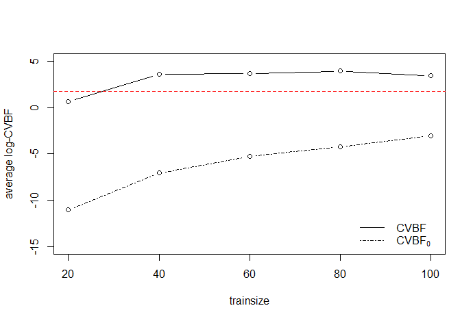
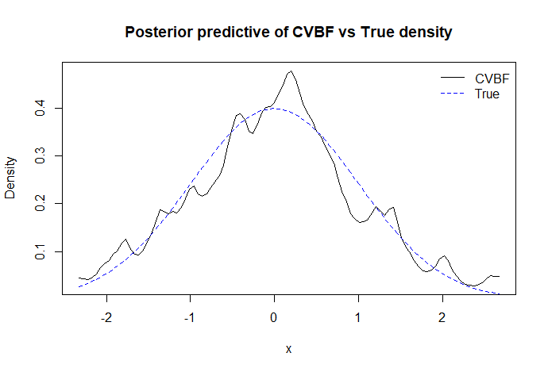

# CVBF Two-Sample Testing

This repository presents illustrative examples and provides codes for the methodology described in the following paper:

&nbsp;&nbsp;&nbsp;&nbsp;&nbsp;&nbsp;&nbsp;&nbsp; "**Use of Cross-validation Bayes Factors to Test Equality of Two Densities**"

Nonparametric hypothesis testing is an important branch of statistics with broad applications. Hart and Choi (2017) propose a nonparametric, Bayesian test to compare the fit of parametric and nonparametric models, called cross-validation Bayes factor (CVBF). The CVBF is an objective Bayesian procedure where the nonparametric model for densities is a kernel estimate. However, the standard version of kernel estimates cannot be used directly in Bayesian analysis because they become models only after being computed from the data. This issue is resolved by computing a kernel estimate from a subset of the data, and then using the estimate as a model for the remaining data. In this paper, we propose a CVBF approach for testing the equality of two densities, a well-studied subject in the frequentist literature. We demonstrate the effectiveness of the test through a simulation study and an application to real data. Our numerical experiments reveal that this new procedure outperforms the Holmes et al. (2015)'s Polya Tree method under the null hypothesis.

## Example

The `R` package [BSCRN](https://github.com/naveedmerchant/BayesScreening) provides functions that implement our procedure. The value returned by the test is log Bayes factor, not p-value. If they are positive and not close to 0, that should imply that the two distributions are different. If they are negative and not close to 0, that should imply the two distributions are the same. If they are close to 0, the test is inconclusive. To illustrate the workflow of the procedure, we apply our test for a simulation data. The data is generated from two specified densities, $f$ and $g$. We assume that $f$ and $g$ are $\phi(x)$ (standard normal) and $0.5\phi(x) + 0.5\phi(x/2)/2$, respectively.

``` r
devtools::install_github("naveedmerchant/BayesScreening")
```
``` r
library(BSCRN)
```
``` r
set.seed(1000)
dlength <- 200
p <- 0.5
dataset1 <- rnorm(dlength)
dataset2 <- c()
unifdraw = runif(dlength)
for(j in 1:dlength){
  if(unifdraw[j] > p){
    dataset2[j] = rnorm(1)
  }
  else{
    dataset2[j] = rnorm(1, mean = 0, sd = sqrt(4))
  }
}

```

We compute CVBFs for candidate training set sizes, $r = 20,40,60,80,100$ for the first sample, across 200 random splits.

``` r
numsplits <- 200
propr <- seq(from = 20, by = 20, to = 100)
m <- length(dataset1); n<- length(dataset2)
logBFmat = matrix(nrow = numsplits, ncol = length(propr))
for(j in 1:numsplits){
  for(k in 1:length(propr)){
    s = ceiling((m / n) * propr[k])
    logBFmat[j,k] = CVBFtestrsplit(dataset1 = dataset1, dataset2 = dataset2, trainsize1 = propr[k], trainsize2 = s)$logBF
  }
}
logBFmean <- colMeans(logBFmat)

```

Then, we compute the Bayes factors using a permutation-based method. The goal of this approach is to determine an ideal training set size. By applying the method to combined datasets, we aim to identify the training size that yields Bayes factors with desirable behavior in terms of "Type I error".

``` r
jointset = c(dataset1, dataset2)
permlogBFmat = matrix(nrow = numsplits, ncol = length(propr))
for(j in 1:numsplits){
  inds = sample(1:length(jointset), size = m)
  permdataset1 = jointset[inds]
  permdataset2 = jointset[-inds]
  for(k in 1:length(propr)){
    s = ceiling((m / n) * propr[k])
    permlogBFmat[j,k] = CVBFtestrsplit(dataset1 = permdataset1, dataset2 = permdataset2, trainsize1 = propr[k], trainsize2 = s)$logBF
  }
}
permlogBFmean <- colMeans(permlogBFmat)

```

Plot the averaged log-Bayes factors. From the figure, we observe that the Bayes factors calculated using the permutation-based method favor the null hypothesis across all candidate training set sizes. Consequently, we select the training set size $r = 100$ which is the largest among them.

``` r
plot(propr, logBFmean, ylim=c(-15, 5), xlab='trainsize', ylab='average log-CVBF', type='b', lty=1)
lines(propr, permlogBFmean, type='b', lty=4)
abline(h = sqrt(3), col='red',lty=2)
legend("bottomright", legend=c("CVBF", expression(CVBF[0])), lty=c(1,4), bty="n")

```

<p align="center">
  
</p>

For a Bayesian non-parametric test to be effective, it should adopt an assumption about the underlying distribution of the dataset. By examining the posterior predictive distribution of the test, we can gain insight into what the Bayesian non-parametric procedure infers about the underlying distribution of the data.

``` r
XT1 = dataset1[1:100]
XV1 = dataset1[101:200]
predbwvec1 = PredCVBFIndepMHbw(ndraw = 200, maxIter = 1000, XT1 = XT1, XV1 = XV1)
predpostsamp = PredCVBFDens(predbwvec1$predbwsamp, XT1 = XT1)
plot(seq(from = min(dataset1), to = max(dataset1), length.out = 100) , predpostsamp(seq(from = min(dataset1), to = max(dataset1), length.out = 100)),type='l', xlab = "x", ylab = "Density", main = "Posterior predictive of CVBF vs True density")
lines(seq(from = min(dataset1), to = max(dataset1), length.out = 100) , dnorm(seq(from = min(dataset1), to = max(dataset1), length.out = 100)), col = "blue",lty = 2)
legend("topright", legend=c("CVBF", "True"), col=c('black','blue'), lty=c(1,2), bty="n")

```

<p align="center">
  
</p>


## Codes

We provide codes to reproduce the results presented in the paper. The files are organized as follows:

* functions
    * `MarginalLikIntfunctions.R` contains functions to compute the marginal likelihoods in the CVBF and Holmes' Polya Tree method.

* Simulations
    * `simulationsnullsamplesizes.R` tests the performance of our method against the Polya Tree method under the null case by comparing two standard normal distributions.
    * For the alternative cases, we explore four scenarios where two distributions, denoted as $f$ and $g$, differ. Our test is compared with the Polya Tree method (using normal and Cauchy as base distributions) and the Kolmogorov-Smirnov test.
         1. `BayesSimShortTailvsShortTailSAsimsAVG.Rmd` reproduces result for *(a) Scale change*, where the $f$ and $g$ are $\phi(x)$ (standard normal) and $\phi(x/2)/2$, respectively.
         2. `BayesSimLongTailvsLongTailSAsimsAVG.Rmd` reproduces result for *(b) Location shift*, where the $f$ and $g$ are $f_{C}(x)$ (standard Cauchy) and $f_{C}(x+1)$, respectively.
         3. `BayesSimShortTailvsLongTailSAsimsAVG.Rmd` reproduces result for *(c) Tail difference*, where the $f$ and $g$ are $f_{C}(x)$ and $0.6745\phi(0.6745x)$, respectively.
         4. `CompactSupportBayesSimSAsimsAVG.Rmd` reproduces result for *(d) Finite support*, where $f$ and $g$ are $U(0,1)$ (uniform on the interval (0,1)) and $\text{beta}(4,4)$, respectively.

* Application to Higgs boson dataset
    * The Higgs boson dataset can be downloaded from the [UCI Machine Learning repo](https://archive.ics.uci.edu/dataset/280/higgs).
    * `HiggsBosonCol23andCol29withRpackage.Rmd` applies CVBF to a subset of the 23rd and 29th column of the dataset.
    * `HiggsBosonRfilewithRpackage.Rmd` uses the same dataset to compute predictive posteriors of the densities, providing a comparison between our method and Polya Trees.
    * `randsbytype1error.R` uses the same dataset to compute log Bayes factors under the null hypothesis, applying a permutation-based method.
 
## References
* Holmes, C.C. et al. (2015). Two-sample Bayesian Nonparametric Hypothesis Testing. Bayesian Analysis, 10(2):297-320. (https://projecteuclid.org/euclid.ba/1422884976)
* Hart, J.D. and Choi, T. (2017). Nonparametric Goodness of Fit via Cross-Validation Bayes Factors. Bayesian Analysis, 12(3):653-677. (https://projecteuclid.org/journals/bayesian-analysis/volume-12/issue-3/Nonparametric-Goodness-of-Fit-via-Cross-Validation-Bayes-Factors/10.1214/16-BA1018.full)
