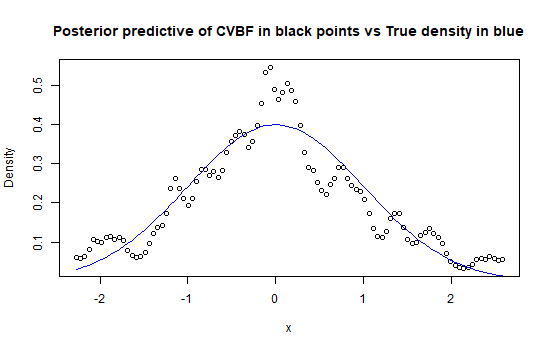

# CVBF Two-Sample Testing

This repository contains code and illustrative examples for the methodology described in the following paper:

&nbsp;&nbsp;&nbsp;&nbsp;&nbsp;&nbsp;&nbsp;&nbsp; "**Use of Cross-validation Bayes Factors to Test Equality of Two Densities**"

Nonparametric hypothesis testing is an important branch of statistics with broad applications. Hart and Choi (2017) propose a nonparametric, Bayesian test to compare the fit of parametric and nonparametric models, termed cross-validation Bayes factor (CVBF). The CVBF is an objective Bayesian procedure where the nonparametric model for densities is a kernel estimate. However, the standard version of kernel estimates cannot be used directly in Bayesian analysis because they become models only after being computed from the data. This issue is resolved by computing a kernel estimate from a subset of the data, and then using the estimate as a model for the remaining data. In this paper, we propose a CVBF approach for testing the equality of two densities, a well-studied subject in the frequentist literature.

## Installation

The `R` package `BSCRN` provides functions that implement our procedure. The package is available from [Github](https://github.com/naveedmerchant/BayesScreening) with:

``` r
# install.packages("devtools")
devtools::install_github("naveedmerchant/BayesScreening")

```

## Usage

To demonstrate the usage of this package, we apply our test to a set of simulated data.

### Testing whether two data sets share the same distribution

Testing whether two data sets share the same distribution can be challenging if no parametric distribution is specified for the data sets. This package provides functions that implement the CVBF procedure for this problem, allowing the test to be performed without specifying a distribution. The test returns log Bayes factors. A positive log Bayes factor, significantly different from 0, suggests that the two distributions are different. Conversely, a negative log Bayes factor, substantially different from 0, indicates that the two data sets come from the same distribution. If the log Bayes factor is close to 0, the result is inconclusive.

#### Example
``` r
library(BSCRN)
```
``` r
set.seed(100)
# generate noise with same distribution
dataset1 = rnorm(200)
dataset2 = rnorm(200)
logCVBF1 = CVBFtestrsplit(dataset1, dataset2, trainsize1 = 100, trainsize2 = 100)
logCVBF1$logBF
#> [1] -0.1178948
 
# generate noise with different distribution 
dataset3 = rnorm(200, mean = 0, sd = 4)
logCVBF1 = CVBFtestrsplit(dataset1, dataset3, trainsize1 = 100, trainsize2 = 100)
logCVBF1$logBF
#> [1] 45.93324
```

### Posterior predictive checking of the test

To construct a Bayesian nonparametric test, one should adopt a Bayesian nonparametric model for the underlying distribution of the dataset. By examining the posterior predictive distribution of this model, we can gain insights into what the procedure infers about the data's underlying distribution.

#### Example
``` r
# CVBF posterior predictive
set.seed(100)
dataset1 = rnorm(200)
XT1 = dataset1[1:100]
XV1 = dataset1[101:200]
predbwvec1 = PredCVBFIndepMHbw(ndraw = 200, maxIter = 1000, XT1 = XT1, XV1 = XV1)
predpostsamp = PredCVBFDens(predbwvec1$predbwsamp, XT1 = XT1)
plot(seq(from = min(dataset1), to = max(dataset1), length.out = 100) , predpostsamp(seq(from = min(dataset1), to = max(dataset1), length.out = 100)), xlab = "x", ylab = "Density", main = "Posterior predictive of CVBF in black points vs True density in blue")
lines(seq(from = min(dataset1), to = max(dataset1), length.out = 100) , dnorm(seq(from = min(dataset1), to = max(dataset1), length.out = 100)), col = "blue")

```

<p align="center">
  
</p>


### Application to Higgs boson data
The file `HiggsBosonCol23andCol29withRpackage.Rmd` reproduces the results of the data analysis for the Higgs boson dataset. It applies CVBF to a subset of the 23rd and 29th column of the dataset. The dataset can be downloaded from the [UCI Machine Learning repo](https://archive.ics.uci.edu/dataset/280/higgs).
    
## References
* Hart, J.D. and Choi, T. (2017). Nonparametric Goodness of Fit via Cross-Validation Bayes Factors. Bayesian Analysis, 12(3):653-677. (https://projecteuclid.org/journals/bayesian-analysis/volume-12/issue-3/Nonparametric-Goodness-of-Fit-via-Cross-Validation-Bayes-Factors/10.1214/16-BA1018.full)
